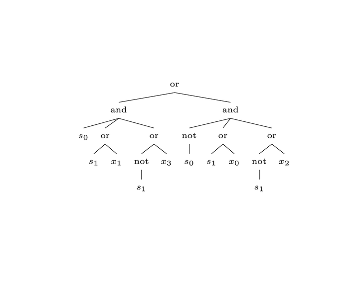

# "BoolFormer" Layer Optimization with SynthDgen Integration

## Overview
Welcome to the BoolFormer Layer Optimization documentation. This README outlines the strategy for enhancing the BoolFormer layer within my neural network models, designed for the symbolic regression of logical functions. With the recent integration of an attention mechanism and a trainable threshold, I utilize the SynthDgen script to generate synthetic sensor data, which is essential for training and refining the BoolFormer layer.
_______________________________________
The BoolFormer architecture is based on the seminal thesis by `Stéphane d'Ascoli`. His research provides a methodological foundation for the development of this project.

Note: The BoolFormer class depicted above might be fully realized for application toward symbolic boolean regression; though, for this, it is in the prototype stage and has not been fully optimized or finalized for production use.

## Acknowledgements
I would like to acknowledge the significant contribution of Stéphane d'Ascoli, whose thesis on BoolFormer architecture for symbolic Boolean regression has been a critical resource. The thesis titled "Boolformer: Symbolic Regression of Logic Functions with Transformers," co-authored with Samy Bengio, Josh Susskind, and Emmanuel Abbé, has been instrumental in the conceptualization of this layer.

## Key Components
- **BoolFormer Layer**: A custom TensorFlow layer with advanced data processing capabilities for symbolic regression in robotics applications.
- **SynthDgen Script**: A Python-based generator of synthetic sensor data that plays a critical role in the BoolFormer layer's development.

## SynthDgen Integration
The SynthDgen script is now a key player in crafting complex, adaptive synthetic datasets. These datasets are designed to mimic intricate sensor data, serving as a robust testbed for the BoolFormer layer's capabilities.

## Development Objectives
1. **Dynamic Adaptation**: I am committed to regularly updating the BoolFormer layer, informed by the rich data generated by SynthDgen.
2. **Performance Metrics**: The synthetic data from SynthDgen are pivotal in evaluating and boosting the BoolFormer layer's performance.

## Model Evolution
I aim to progressively enhance the BoolFormer layer, leveraging the advanced data generation capabilities of SynthDgen for continual optimization.

## Advanced Synthetic Data Utilization
I am implementing complex scenarios using SynthDgen data to challenge the BoolFormer layer, with targeted feedback loops for strategic refinements.

## Strategic Enhancement
1. **Self-Optimization**: My goal is to develop self-adjusting capabilities within the BoolFormer layer, driven by the insights gleaned from SynthDgen.
2. **Cross-Disciplinary Approaches**: I employ diverse scientific and technical expertise to inform the BoolFormer layer's evolution, guided by the data landscapes created by SynthDgen.

## Experimental Framework
A robust experimental framework is in place, involving rigorous testing cycles powered by SynthDgen's synthetic data. This iterative approach is essential for the ongoing refinement of the BoolFormer layer, with a strong focus on performance and insights obtained from the synthetic datasets.

This README and the accompanying logic tree image will be saved in the relevant project directory for easy reference.
